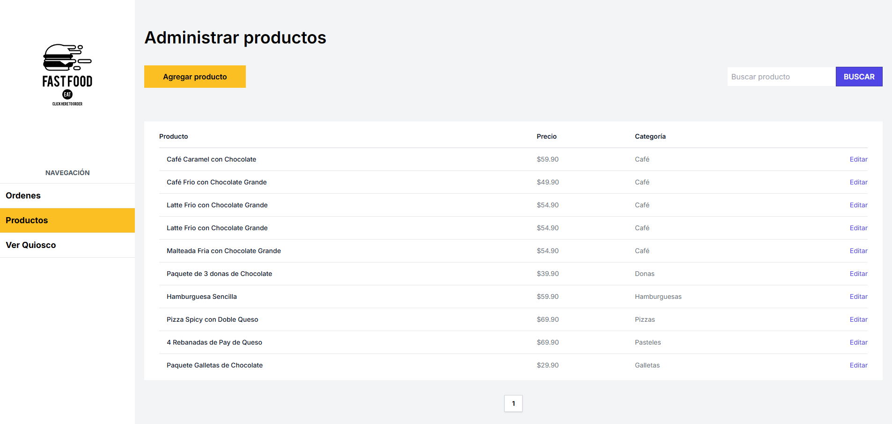
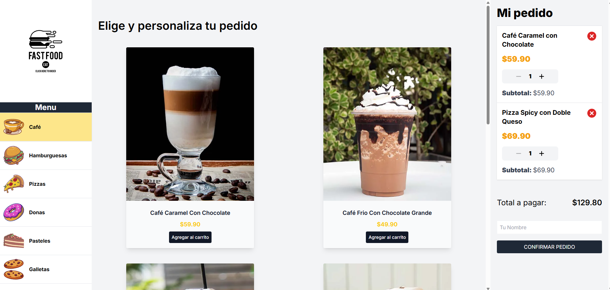
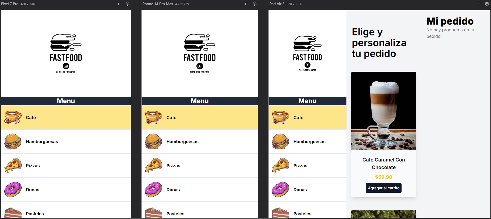

# Next Quiosco App

Next Quiosco App es un proyecto de portfolio full stack construido con Next.js para demostrar producto, criterio técnico y una experiencia de review clara. Incluye flujo público de compra, panel administrativo y un modo demo tolerante a fallos para que se pueda evaluar incluso si la base de datos externa no está disponible.

## Quick Path

1. Ejecuta la app localmente con `npm install`, `npx prisma generate` y `npm run dev`.
2. Abre `/` para leer la landing y entrar a las rutas principales de review.
3. Recorre `/order/cafe`, `/admin/products` y `/admin/orders` para validar la experiencia completa.

## 🚀 Tecnologías Utilizadas

Este proyecto fue desarrollado utilizando las siguientes tecnologías y herramientas:

- **Next.js**: Framework de React para aplicaciones web modernas.
- **React**: Biblioteca para construir interfaces de usuario.
- **TypeScript**: Tipado estático para un desarrollo más robusto.
- **Prisma**: ORM para la gestión de la base de datos.
- **MongoDB**: Base de datos para guardar la información.
- **TailwindCSS**: Framework de CSS para un diseño rápido y responsivo.
- **SWR**: Manejo de datos en tiempo real con revalidación automática.
- **Zod**: Validación de esquemas de datos.
- **React Toastify**: Notificaciones elegantes y personalizables.
- **Zustand**: Manejo de estado simple y escalable.
- **Cloudinary**: Gestión de imágenes en la nube.

## 🌟 Qué demuestra este proyecto

| Área | Decisión |
|-------|----------|
| Experiencia de producto | Flujo público de compra con categorías, carrito lateral y confirmación de pedido. |
| Backoffice | Panel admin para productos, búsquedas, edición y seguimiento operativo de órdenes. |
| Calidad técnica | Server Actions, Zod, Prisma, SWR y Zustand para separar responsabilidades y mantener feedback consistente. |
| Portfolio review | Landing inicial con guía de uso y demo fallback para entrevistas o revisiones asincrónicas. |
| Resiliencia | Si Mongo falla, varias vistas siguen navegables usando datos demo en memoria. |

## 📸 Capturas de Pantalla

### Vista del Panel de Administración

<div align="center">
  
</div>

### Vista del Panel de Usuario

<div align="center">
  
</div>

### Vista Responsiva

<div align="center">
  
</div>

## 🌐 Demo en Vivo

Puedes probar la aplicación en los siguientes enlaces:

- **Panel de Administración**: [https://next-tienda-one.vercel.app/admin/products](https://next-tienda-one.vercel.app/admin/products)
- **Panel de Usuario**: [https://next-tienda-one.vercel.app/order/cafe](https://next-tienda-one.vercel.app/order/cafe)
- **Vista de retiro de ordenes**: [https://next-tienda-one.vercel.app/orders](https://next-tienda-one.vercel.app/orders)

## 🛠️ Instalación y Uso

Sigue estos pasos para ejecutar el proyecto localmente:

1. Clona este repositorio:
   ```
   git clone https://github.com/leamartinez1707/next-tienda.git
   cd next-tienda
   ```
2. Instala las dependencias
   ```
    npm install
   ```
3. Configura las variables de entorno: crea un archivo `.env` en la raíz del proyecto y agrega las variables necesarias para la conexión a la base de datos y Cloudinary.
   
  Variables recomendadas:
  ```
  DATABASE_URL=...
  CLOUDINARY_CLOUD_NAME=...
  CLOUDINARY_API_KEY=...
  CLOUDINARY_API_SECRET=...

  # Opcional: timeout para consultas Prisma (ms). Default: 8000
  DB_QUERY_TIMEOUT_MS=8000

  # Opcional: fallback a datos demo cuando la BD falla.
  # En produccion ahora es false por defecto.
  DEMO_FALLBACK_ENABLED=false

  # Seguridad panel admin (opcional, recomendado)
  ADMIN_BASIC_USER=admin
  ADMIN_BASIC_PASSWORD=tu_password_segura
  ```
4. Genera el cliente de Prisma:
    ```
    npx prisma generate
    ```
5. Ejecuta el servidor de desarrollo:
    ```
    npm run dev
    ```
6. Abre la aplicación en tu navegador en http://localhost:3000.

## Detalles de review

- La home (`/`) explica el alcance del proyecto y propone un orden corto para revisarlo.
- Las rutas principales para portfolio son `/order/cafe`, `/admin/products` y `/admin/orders`.
- Si la conexión real con MongoDB falla, el proyecto mantiene una demo navegable en varias vistas para no romper la evaluación funcional.

### Estructura del Proyecto
    
    next-quiosco-app/
    ├── actions/          # Acciones del servidor
    ├── components/       # Componentes reutilizables
    ├── prisma/           # Configuración y esquemas de Prisma
    ├── public/           # Archivos estáticos
    ├── app/              # Código fuente principal y Paginas
    ├── src/              # Utilidades y Store
    
## Contacto

### Si tienes alguna consulta o sugerencia, no dudes en contactarme:

#### Email: leandromartinez.dev@gmail.com
#### Portafolio: https://leandromartinez.dev/